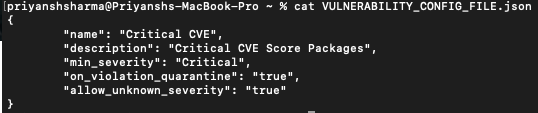
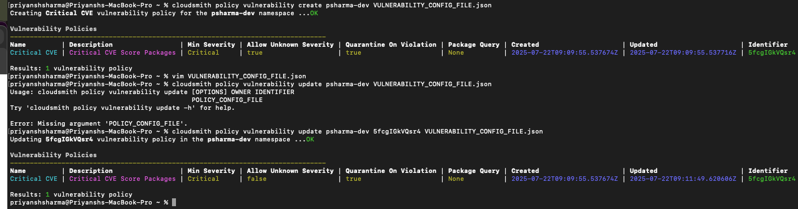

# Task 4: Account Settings

This section describes how I used the Cloudsmith CLI to configure my organization's Licence and Vulnerability policies, with annotated commands and supporting screenshots.

---

## 1. Create a New Licence Policy

To enhance security and compliance, I created a license policy that restricts packages that don't have the Apache Free License v3.0:

### Configuration Used

```
{
	"name": "AFL v3.0",
	"description": "Academic Free License version 3.0",
	"allow_unknown_licenses": "false",
	"on_violation_quarantine": "true",
	"spdx_identifiers": [
		 "AFL-3.0"
	],
	"package_query_string": "repository:cloudsmith-cli-psharma-dev"
}
```


### Command Used

> cloudsmith policy license create psharma-dev LICENSE_POLICY_CONFIG.json


## 2. Create a New Vulnerability Policy

For automated security monitoring, I created a vulnerability policy to quarantine packages with high-severity CVEs:

### Configuration Used

```
{
        "name": "Critical CVE",
        "description": "Critical CVE Score Packages",
        "min_severity": "Critical",
        "on_violation_quarantine": "true",
        "allow_unknown_severity": "false"
}
```



### Command Used

> cloudsmith policy vulnerability create psharma-dev VULNERABILITY_CONFIG_FILE.json





## Navigation

- [Home](index.md)
- [Previous Task: Package Management](Package_Management.md)

