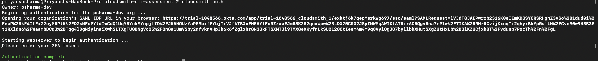

## Installing and Configuring Cloudsmith CLI

### Installation of Cloudsmith CLI

The Cloudsmith CLI was installed on my device using Homebrew by first adding the Cloudsmith tap and then installing the CLI tool with the following commands:

> brew tap cloudsmith-io/cloudsmith-cli

> brew install cloudsmith-cli

This method provides a straightforward way to install and keep the CLI up to date on macOS systems

### Configuration of Cloudsmith CLI
Because my Cloudsmith organization has SAML Single Sign-On (SSO) enabled, I configured authentication using the recommended `cloudsmith auth` command. This approach supports SAML SSO workflows required by my organization's security policies.

To configure authentication, I ran:

> cloudsmith auth

A pop-up appeared on the terminal asking for my organization slug. After entering it, I was prompted to enter the MFA token from the SAML app. After entering it, I successfully authenticated with the CLI.

Below is a screenshot showing the Cloudsmith CLI authentication process:

## Navigation

- [Home](index.md)
- [Next Task: Package Management](Package_Management.md)

