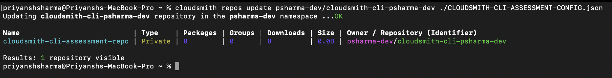
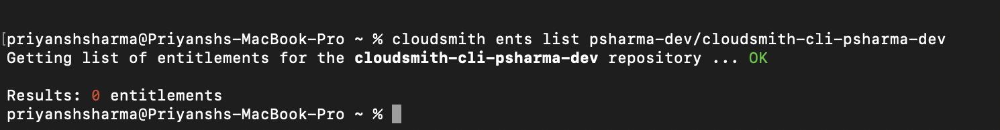
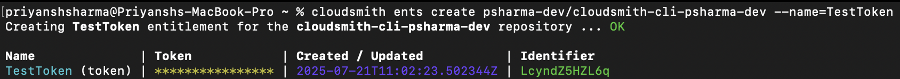
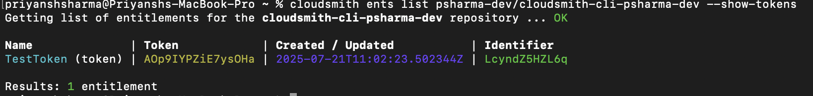
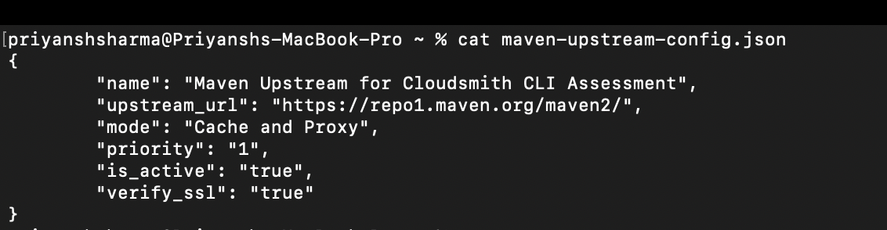
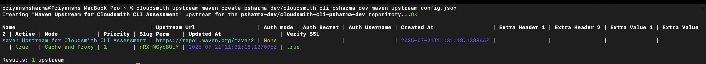

# Task 2: Create and Manage Repositories

This section documents how I used the Cloudsmith CLI to manage repositories within my Cloudsmith organization, with key screenshots demonstrating each operation.

---

## 1. Create a New Public Repository

To create a new **public repository**, first, you must make a REPO-CONFIG.json configuration file. For example:

```
{
    "name": "Example Repository",
    "description": "Example packages repository",
    "repository_type_str": "Private",
    "slug": "example-repo1"
}
```

I created the **CLOUDSMITH-CLI-ASSESSMENT-CONFIG.json** to create a repository. Below is a screenshot with details of this configuration file


You can then run the command

> cloudsmith repos create psharma-dev CLOUDSMITH-CLI-ASSESSMENT-CONFIG.json

And the repository in your organization was created.


## 2. List all repositories in your organisation

To view all repositories and capture the output in a text file:

> cloudsmith repos list > repos-list.txt

A list of all the repositories in my organization was available in the text file repos-list.txt


## 3. Update a repository

To update the repository’s description and change the type from Public to Private, I made changes in the **CLOUDSMITH-CLI-ASSESSMENT-CONFIG.json** file that we created before.

> cloudsmith repos update psharma-dev/cloudsmith-cli-psharmav-repo --description "Updated description for the repository" --visibility private




## 4. Create a new entitlement token in a repository

To create an entitlement token for controlled access:

> cloudsmith ents create psharma-dev/cloudsmith-cli-psharma-dev --name=TestToken

As we can see, there were no entitlement tokens for the repository we created in step 1 before.



After running the above command, an entitlement token was created for the repository



Now, we can see that there is one entitlement token available




## 5. Create a new upstream for Maven Central in this repository

To add an upstream for Maven Central, firstly, I created a config file **maven-upstream-config.json**, making it possible to proxy dependencies:



Then, we run the following command:

> cloudsmith upstream maven create psharma-dev/cloudsmith-cli-psharma-dev maven-upstream-config.json

This uses the Maven Central repository as an upstream proxy for the current Cloudsmith repository.




