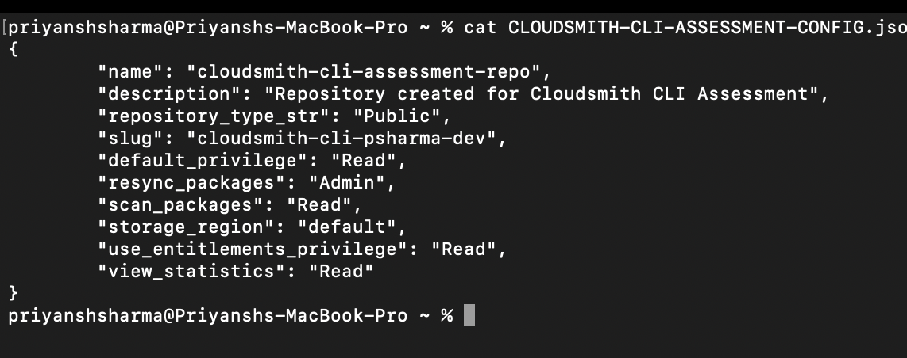
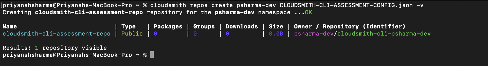

# Task 2: Create and Manage Repositories

This section documents how I used the Cloudsmith CLI to manage repositories within my Cloudsmith organization, along with key screenshots to demonstrate each operation.

---

## 1. Create a New Public Repository

To create a new **public repository**, first, you need to create a REPO-CONFIG.json configuration file. For example:

```
{
    "name": "Example Repository",
    "description": "Example packages repository",
    "repository_type_str": "Private",
    "slug": "example-repo1"
}
```

I created the **CLOUDSMITH-CLI-ASSESSMENT-CONFIG.json** for creating a repository. Below is a screenshot with details of this configuration file


You can then run the command

> cloudsmith repos create psharma-dev CLOUDSMITH-CLI-ASSESSMENT-CONFIG.json

And the repository in your organization was created.



