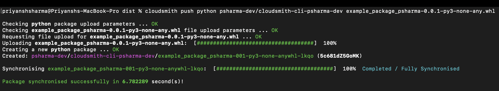
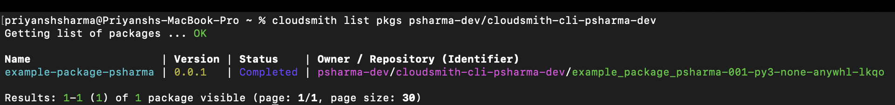
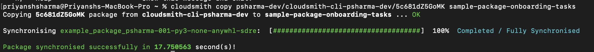
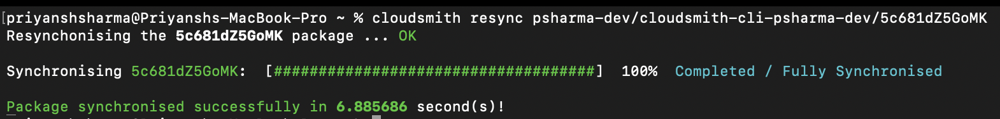
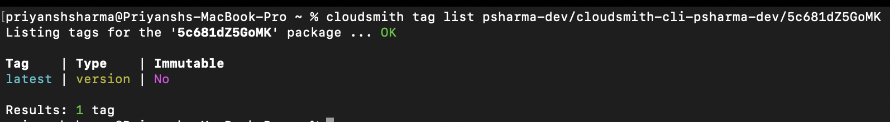
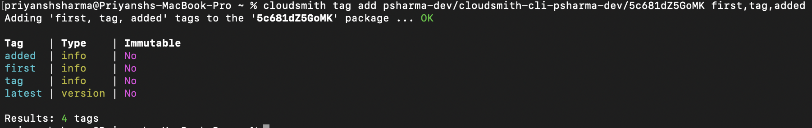
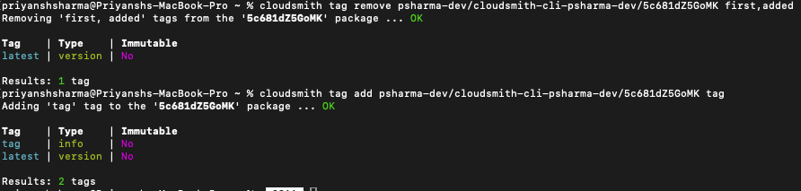

# Task 3: Package Management

This page details how I used the Cloudsmith CLI for package operations in my organization’s repositories. All terminal outputs are evidenced by corresponding screenshots.

## 1. Upload a Package

I created a simple package (`example_package_psharma-0.0.1-py3-none-any.whl`) for upload. To upload it to the repository created in Task 2:

Full CLI example:
`loudsmith push python [OPTIONS] OWNER/REPO PACKAGE_FILE`

> cloudsmith push python psharma-dev/cloudsmith-cli-psharma-dev example_package_psharma-0.0.1-py3-none-any.whl

## 2. List All Packages in a Repository

This command lists all available packages within the specified repository.

Full CLI example:
`cloudsmith list pkgs [OPTIONS] OWNER/REPO`

> cloudmsith list pkgs psharma-dev/cloudsmith-cli-psharma-dev

## 3. Copy the Package to Another Repository

To copy the previously uploaded package to a different repository, we need the  package slug and the other repository slug:

Full CLI example:
`$ cloudsmith cp your-org/awesome-repo/better-pkg other-repo`

> cloudsmith copy psharma-dev/cloudsmith-cli-psharma-dev/5c681dZ5GoMK sample-package-onboarding-tasks

## 4. Resynchronise the package in the repository

This operation ensures the package metadata and status are refreshed:

Full CLI example:
`$ cloudsmith resync your-org/awesome-repo/better-pkg`

> cloudsmith resync psharma-dev/cloudsmith-cli-psharma-dev/5c681dZ5GoMK

## 5. List tags for the package in the repository.

Displays all current tags on the package.

Full CLI example:
`$ cloudsmith tags list your-org/awesome-repo/better-pkg`

> cloudsmith tag list psharma-dev/cloudsmith-cli-psharma-dev/5c681dZ5GoMK

## 6. Add tags to the package in the repository

To add tags `first`, `tag`, and `added`:

Full CLI example:
`$ cloudsmith tags add your-org/awesome-repo/better-pkg foo,bar`

> cloudsmith tag add psharma-dev/cloudsmith-cli-psharma-dev/5c681dZ5GoMK first,tag,added

## 7. Remove tags from the package in the repository

To remove tags `first` and `added`:

Full CLI example:
`$ cloudsmith tags remove your-org/awesome-repo/better-pkg foo,bar`

> cloudsmith tags remove psharm-dev/cloudsmith-cli-psharma-dev/5c681dZ5GoMK first,added

## Navigation

- [Home](index.md)
- [Previous Task: Create and Manage Repositories](Create_And_Manage_Repositories.md)
- [Next Task: Account Settings](Account_Settings.md)

